# Architecture: Luna OpenClaw + PIXELCARTEL Ecosystem

## What Is PIXELCARTEL?

**PIXELCARTEL** is the primary commercial product that Luna builds, deploys, and maintains. It is a pixel-art NFT/card trading marketplace (React + Vite + Tailwind + Node.js/Express + PostgreSQL). This repository (`githubPIXELCARTEL`) serves **dual purpose**:

1. **The PIXELCARTEL App Source** — the actual marketplace codebase Luna builds via her `web-artifacts-builder` skill.
2. **The Luna Fallback Checkpoint Hub** — `openclaw_fallback_checkpoint.tar.gz` is the production snapshot of Luna's entire OpenClaw configuration, stored here for disaster recovery.

---

## Full System Topology

```mermaid
graph TD
    subgraph LOCAL["🖥️ Local Machine (Windows)"]
        REPO["githubPIXELCARTEL\n(This Repo)"]
        AG["Antigravity\n(AI Coding Agent)"]
        SYNC["scripts/luna_checkpoint_sync.ps1\n(Automation)"]
        HEALTH["scripts/luna_vps_health.ps1\n(Health Check)"]
    end

    subgraph GITHUB["☁️ GitHub"]
        GH["pixxelcartel-del/githubPIXELCARTEL\nbranch: chore/luna-build-checkpoint"]
        CHECKPOINT["openclaw_fallback_checkpoint.tar.gz\n(Fallback Snapshot)"]
    end

    subgraph VPS["🖥️ Luna VPS (100.80.74.21 | Tailscale)"]
        GW["openclaw-gateway.service\n(systemd)"]
        
        subgraph AGENTS["👥 Agent Pool"]
            LUNA["luna (default orchestrator)"]
            ELON["elon (codex/gpt-5.4)"]
            MARK["mark (codex/gpt-5.4)"]
            ERNEST["ernest"]
            SUNTZU["sun-tzu"]
            A["a"]
        end

        subgraph SKILLS["🛠 Skills / Factory Engines"]
            WAB["web-artifacts-builder\n→ Builds PIXELCARTEL"]
            TF["theme-factory\n→ snippets/ library"]
            CAE["content-automation-engine\n→ n8n bridge"]
            YT["youtube-full"]
            GV["gary-vee-social"]
            LC["luna-core-agent"]
            SC["skill-creator"]
        end

        subgraph MEMORY["🧠 Memory Stack"]
            MEM0["openclaw-mem0 plugin"]
            QDRANT["Qdrant\n(localhost:6333)\nvector store"]
            NOMIC["nomic-embed-text\n(embeddings)"]
            GPT4MINI["gpt-4o-mini\n(mem processing)"]
        end

        subgraph INTEGRATIONS["🔗 Integrations"]
            TG["Telegram Bot\n(enabled: true)"]
            N8N["n8n Workflows\n(localhost:5678)"]
            VERCEL["Vercel\n(VERCEL_API_TOKEN)"]
            GH_MCP["github-mcp-server\n(NOT in live config)"]
            N8N_MCP["n8n-mcp\nlocalhost:5678/mcp\n(Tailscale=off)"]
        end
    end

    subgraph PIXELCARTEL_APP["🎮 PIXELCARTEL App (Built by Luna)"]
        FE["Frontend\nReact + Vite + Tailwind"]
        BE["Backend\nNode.js + Express"]
        DB["Database\nPostgreSQL"]
        VERCEL_DEPLOY["Deployed on Vercel"]
    end

    %% Local → GitHub
    REPO -->|"git push"| GH
    GH -->|"fallback"| CHECKPOINT

    %% Local → VPS
    AG -->|"SSH / SCP"| GW
    SYNC -->|"capture + pull + push"| GW
    HEALTH -->|"read-only SSH"| GW

    %% VPS Internal
    GW --> LUNA
    LUNA -->|"delegates"| ELON
    LUNA -->|"delegates"| MARK
    LUNA -->|"delegates"| ERNEST
    GW --> SKILLS
    GW --> MEMORY
    MEM0 --> QDRANT
    QDRANT --> NOMIC
    MEM0 --> GPT4MINI

    %% Skills → App
    WAB -->|"builds & deploys"| PIXELCARTEL_APP
    TF -->|"design system"| FE
    CAE -->|"workflows"| N8N

    %% Integrations
    GW --> TG
    GW --> N8N
    WAB --> VERCEL
    GH_MCP -.->|"absent from live config"| GW
    N8N_MCP -.->|"localhost routing"| N8N

    %% VPS → GitHub (checkpoint loop)
    GW -->|"tar.gz snapshot"| CHECKPOINT

    style LOCAL fill:#1e1e2e,color:#cdd6f4
    style GITHUB fill:#161b22,color:#e6edf3
    style VPS fill:#0d1117,color:#c9d1d9
    style PIXELCARTEL_APP fill:#1a1a2e,color:#e94560
```



---

## PIXELCARTEL ↔ Luna Integration Points

| Luna Skill | PIXELCARTEL Role | Status |
|---|---|---|
| `web-artifacts-builder` | Builds, iterates, and deploys PIXELCARTEL to Vercel | 🟢 Active |
| `theme-factory` | Provides the `snippets/` design system (components, tokens) for PIXELCARTEL UI | 🟡 Expanding |
| `content-automation-engine` (n8n) | Automates content ingestion for PIXELCARTEL marketplace (listings, metadata) | 🟢 Active |
| `skill-creator` | Generates new Luna skills when PIXELCARTEL needs new capabilities | 🟢 Active |
| `elon` / `mark` agents | Execute heavy coding tasks for PIXELCARTEL backend/frontend on delegation from Luna | 🔲 Pending validation |

---

## GitHub Fallback Checkpoint Loop

```
VPS ~/.openclaw/  ──tar.gz──▶  /tmp/openclaw_fallback_checkpoint.tar.gz
                                           │
                    scripts/luna_checkpoint_sync.ps1 (SCP pull)
                                           │
                        Local: openclaw_fallback_checkpoint.tar.gz
                                           │
                                    git commit + push
                                           │
                        GitHub: githubPIXELCARTEL repo (persistent)
```

**To restore from checkpoint:**
```bash
scp himel@100.80.74.21:/tmp/restore.tar.gz .
ssh himel@100.80.74.21 "tar -xzf openclaw_fallback_checkpoint.tar.gz -C ~ && systemctl --user restart openclaw-gateway.service"
```

---

## Environment Secrets Map

| Secret | Location | Used By | Note |
|---|---|---|---|
| `VERCEL_API_TOKEN` | `~/.openclaw/.env` | `web-artifacts-builder` | ✅ Live-validated key name |
| `N8N_API_KEY` | `~/.openclaw/.env` | `content-automation-engine` | ✅ Confirmed |
| `N8N_MCP_TOKEN` | `~/.openclaw/.env` | n8n-mcp bridge | ✅ Confirmed |
| `TELEGRAM_BOT_TOKEN` | `openclaw.json` (inline) | Luna gateway (telegram enabled) | ✅ Confirmed |

> **Note:** `N8N_MANAGEMENT_TOKEN` was previously listed — live-validated key is `N8N_MCP_TOKEN`. See AGENT_HANDOFF.md for full 36-secret list.

---

## Automation Scripts

| Script | Purpose | Safe to Auto-Run |
|---|---|---|
| `scripts/luna_vps_health.ps1` | Read-only health check of VPS gateway, Qdrant, n8n, disk, memory | ✅ Yes |
| `scripts/luna_checkpoint_sync.ps1` | Full sync: verify → capture → pull → commit → push | ⚠️ Mutates state |
| `scripts/luna_vps_validate.sh` | Bash script piped via SSH for deep validation | ✅ Yes (read-only) |
